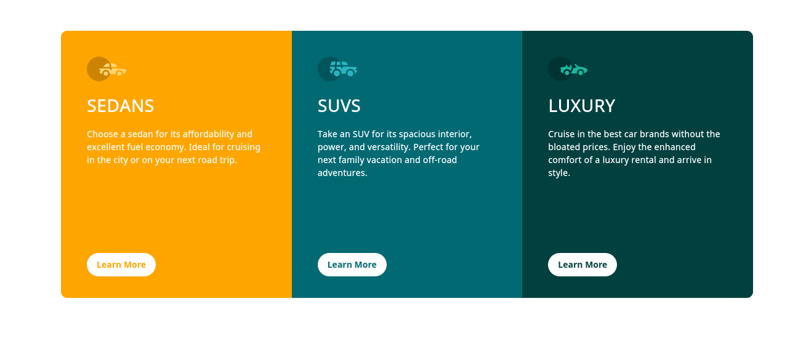

# Frontend Mentor - 3-column preview card component solution

This is a solution to the [3-column preview card component challenge on Frontend Mentor](https://www.frontendmentor.io/challenges/3column-preview-card-component-pH92eAR2-). Frontend Mentor challenges help you improve your coding skills by building realistic projects. 

### The challenge

Users should be able to:

- View the optimal layout depending on their device's screen size
- See hover states for interactive elements

### Screenshot

Screenshot

### Links

- Live Site URL: [Live here](https://product-preview3.vercel.app)

### Built Steps

- First, make a empty markup useing HTML,
- Next, add make them grid align in mobile use CSS,
- Then next make a desktop version,
- keep updated in Git,
- After finish I deploy it using vercel.

### What I learned

- Via in this challenge, I learned a grid properties,
- positioning, transition,..

## Author

- GitHub : [@Govin-R](https://www.github.com/Govin_R)
- Twitter : [@g_repl](https://www.twitter.com/g_repl)

